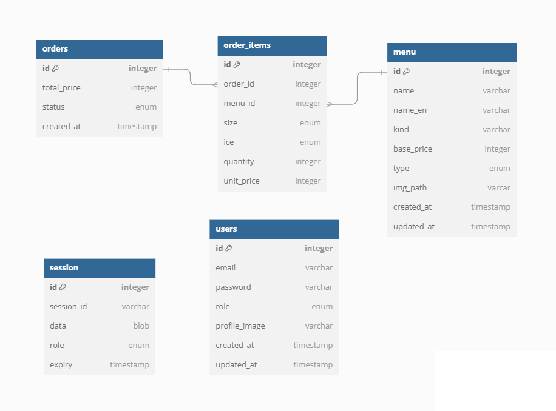

# flask api server

## 목차

- [API 구조](#api-구조)
- [DB 스키마](#db-스키마)
- [To-Do List](#to-do-list)
- [코드 컨벤션](#코드-컨벤션)
- [패키지 구조](#패키지-구조)
- [기술 스택](#기술-스택)
- [실행 방법](#실행-방법)
- [트러블슈팅](#트러블슈팅)

## API 구조

REST API로 작성하였으며, Menu와 Order 리소스에 관한 CRUD 기능을 구현한다.

### Menu 관련

- **GET** `/menu`
  → 메뉴 리스트를 가져옵니다.
- **POST** `/menu`
  → 새로운 메뉴를 추가합니다.
- **PUT** `/menu/:id`
  → 특정 메뉴를 수정합니다.
- **DELETE** `/menu/:id`
  → 특정 메뉴를 삭제합니다.

### Order 관련

- **GET** `/order`
  → 주문 내역을 가져옵니다.
- **POST** `/order`
  → 새로운 주문을 생성합니다.
- **PUT** `/order/:id`
  → 특정 주문을 수정합니다.

## DB 스키마



## To-Do List

- [ ] GET /order
- [ ] POST /order
- [ ] PUT /order
- [ ] type, ice, size에 대한 옵션 테이블을 생성하고, 기존 메뉴 테이블과 관계 설정하기

## 코드 컨벤션

| 적용 대상                    | 컨벤션               |
| ---------------------------- | -------------------- |
| Class, Exception             | **PascalCase**       |
| Function, Variable, DB Table | **snake_case**       |
| Constant                     | **UPPER_SNAKE_CASE** |
| Indent                       | **Tab**              |

## 패키지 구조

```
├── assets
├── kiosk
├── server
│   ├── app.py / Flask app
│   ├── models.py / ORM model
│   ├── request.py / HTTP request test
│   ├── config.py / Initial option
│   └── requirements.txt / Package Dependency
├── README.md
```

## 기술 스택

Flask
MySQL

## 실행 방법

1. **Clone repository**

```
git clone https://github.com/AlpacaMale/kiosk
```

2. **Install dependency**

```
pip install -r server/requirements.txt
```

3. **Run flask server**

```
python server/app.py
```

## 트러블슈팅

### JSON 인코딩 문제 해결

response.data 에 들어온 JSON 응답이 인코딩이 깨져서 들어왔다.

```
 "name": "\uc544\uba54\ub9ac\uce74\ub178"
```

jsonify를 설정하기 위해서 JSON_AS_ASCII = False 설정을 넣었으나 제대로 작동이 되지 않아
그냥 json 모듈을 사용해서 ensure_ascii=False 옵션을 주고 Response를 같이 사용해서 응답하였다.
